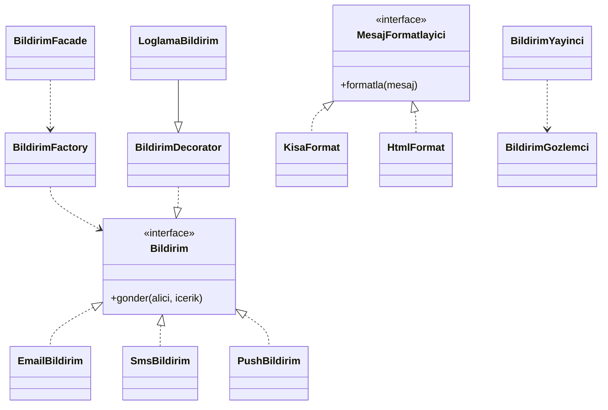

# Bildirim Sistemi

Yazılım Tasarım Örüntüleri dersi bireysel ödevi.
E-posta, SMS ve Push bildirimlerini yöneten,
tasarım örüntüleriyle geliştirilmiş bir Java projesi.

## Kullanılan Örüntüler

| Faz | Örüntü | Amaç |
|-----|--------|------|
| Faz 1 | Factory Method | Nesne yaratmayı merkezi hale getirme |
| Faz 2 | Decorator | Loglama katmanını ayrıştırma |
| Faz 2 | Facade | Karmaşık sistemi basit arayüzle sunma |
| Faz 3 | Observer | Event tabanlı bildirim yayını |
| Faz 3 | Strategy | Runtime'da format değiştirme |

## Mimari Diyagram

## Nasıl Çalıştırılır

1. Projeyi Eclipse'de aç
2. `src/bildirim_sistemi/BildirimSistemi.java` dosyasını bul
3. Sağ tıkla → **Run As → Java Application**
